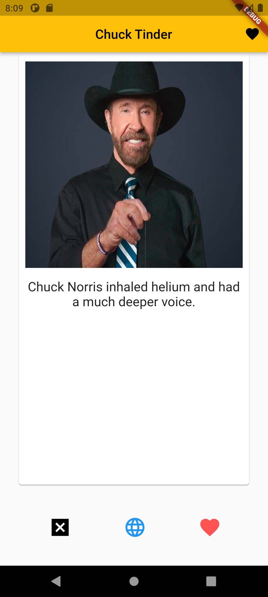
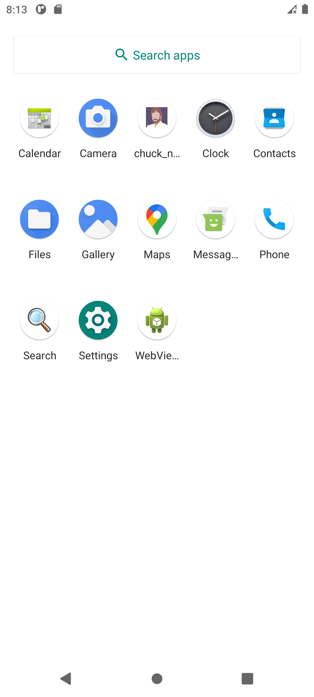

# Description

Tinder app with Chuck Noris jokes. 

Swipe card and get Chuck's joke. 

In my app you can see 3 different images of Chuck (it is loading by URL). Moreover, I have SwipeCard (left and right swipes), buttons 'like' / 'dislike', and button 'open in browser' (blue button at center).

Used riverpod

Added Crashlytics

Joke can be saved to Favourites (In FireStore)

Missing network situation is handled

# Bonuses
Swipes

Open joke in browser

Different images

Store favourites in Firebase

Localisation is implemented

Custom app icon

# Screenshots

  
   
   
  
  

  
   
   
  
  

  
   

# [APK : https://github.com/DamirNabiull/ChuckNorrisTinder/blob/main/app-release.apk](https://github.com/DamirNabiull/ChuckNorrisTinder/blob/main/app-release.apk)